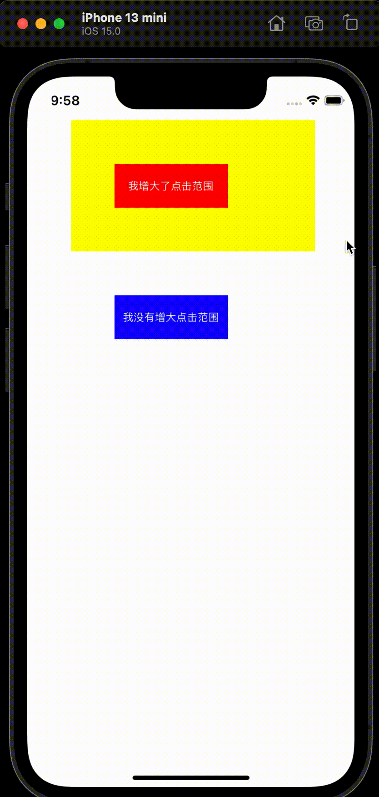

# lsj-EnlargeEdge

[](https://travis-ci.org/lsj/lsj-EnlargeEdge)
[](https://cocoapods.org/pods/lsj-EnlargeEdge)
[](https://cocoapods.org/pods/lsj-EnlargeEdge)
[](https://cocoapods.org/pods/lsj-EnlargeEdge)

## Overview

修改按钮响应事件的范围，来增大点击范围



## Usage

```

// 引入
#import "UIButton+LSJEnlargeEdge.h"


// 使用

[button lsj_setEnlargeEdgeWithTop:50 left:50 bottom:50 right:100];


// 或

[button lsj_setEnlargeEdge:50];

```


## UIButton+LSJEnlargeEdge.h

```
#import <UIKit/UIKit.h>
#import <objc/runtime.h>

/// 延伸响应点击范围
@interface UIButton (LSJEnlargeEdge)


/// 同时向按钮的四个方向延伸响应面积
/// @param size 间距
- (void)lsj_setEnlargeEdge:(CGFloat) size;

/// 向按钮的四个方向延伸响应面积
/// @param top 上间距
/// @param left 左间距
/// @param bottom 下间距
/// @param right 右间距
- (void)lsj_setEnlargeEdgeWithTop:(CGFloat) top left:(CGFloat) left bottom:(CGFloat) bottom right:(CGFloat) right;

@end

```


## Example

To run the example project, clone the repo, and run `pod install` from the Example directory first.

## Requirements

## Installation

lsj-EnlargeEdge is available through [CocoaPods](https://cocoapods.org). To install
it, simply add the following line to your Podfile:

```ruby
pod 'lsj-EnlargeEdge'
```

## Author

lsj, 534016847@qq.com

## License

lsj-EnlargeEdge is available under the MIT license. See the LICENSE file for more info.
